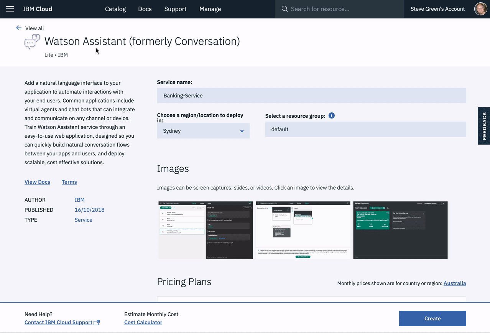

<h1 align="center" style="border-bottom: none;">Aplicativo do Desafio Morty ChatBot usando Watson Assistant(formerly Conversation)</h1>
<h3 align="center">Este aplicativo Node.js demonstra o serviço do Watson Assistant com interface do anime Rick and Morty que envolve tarefas na qual simula uma entrevista.</h3>


Você pode ver uma [demo][demo_url] deste aplicativo.


## Pré-requisitos

1. Criar uma conta do IBM Cloud gratuitamente. [IBM Cloud account](https://console.bluemix.net/registration/).
2. Fazer o Download do [IBM Cloud CLI](https://console.bluemix.net/docs/cli/index.html#overview). *Essa parte não fiz
1. Crie uma instância do serviço Watson Assistant e obtenha suas credenciais:
    - Vá para a página do [Watson Assistant](https://console.bluemix.net/catalog/services/conversation) no IBM Cloud Catalog.
    - Faça login na sua conta do IBM Cloud.
    - Clique em Criar.
    - Clique em Mostrar para ver as credenciais de serviço.
    - Copie o valor de apikey ou copie os valores de nome de usuário e senha se a sua instância de serviço não fornecer um apikey.
    - Copie o valor do URL.

## Configurando o aplicativo

1. No console do IBM Cloud, abra a instância de serviço do Assistente do Watson

2. Clique no ícone ** Importar espaço de trabalho ** na ferramenta de serviço Assistente do Watson. Especifique o local do arquivo JSON da área de trabalho em sua cópia local do projeto de aplicativo:

    <project_root>/training/bank_simple_workspace.json

3. Selecione ** Tudo (Intents, Entities e Dialog) ** e clique em ** Import **. O espaço de trabalho do painel do carro é criado.

4. Clique no ícone do menu no canto superior direito do bloco de espaço de trabalho e, em seguida, selecione ** Ver detalhes **.

5. Clique no ícone para copiar o ID do espaço de trabalho para a área de transferência.

    

6. Na pasta do aplicativo, copie o arquivo chamado
    .env.example 
    e crie um arquivo chamado 
    .env

    No prompt de comenado só digitar o código abaixo:

    cp .env.example .env
    

7. Abra o arquivo * .env * e adicione as credenciais de serviço obtidas na etapa anterior. O SDK do Watson localiza automaticamente as variáveis ambientais corretas para as credenciais `username`,` password` e `url` ou` apikey` e `url` encontradas no arquivo * .env *.

    Exemplo * .env * arquivo que configura o `apikey` e o` url` para uma instância de serviço do Assistente do Watson hospedada na região leste dos EUA:

    ```
    ASSISTANT_IAM_APIKEY=X4rbi8vwZmKpXfowaS3GAsA7vdy17Qh7km5D6EzKLHL2
    ASSISTANT_URL=https://gateway-wdc.watsonplatform.net/assistant/api
    ```

    - Se sua instância de serviço usa credenciais `username` e` password`, adicione as variáveis `ASSISTANT_USERNAME` e` ASSISTANT_PASSWORD` ao arquivo * .env *.

    Exemplo * .env * arquivo que configura o `username`,` password` e `url` para uma instância de serviço do Watson Assistant hospedada na região Sul dos EUA (US South):

    ```
    ASSISTANT_USERNAME=522be-7b41-ab44-dec3-g1eab2ha73c6
    ASSISTANT_PASSWORD=A4Z5BdGENrwu8
    ASSISTANT_URL=https://gateway.watsonplatform.net/assistant/api
    ```
    No entanto, se as suas credenciais contiverem uma chave de API do IAM, copie o `apikey` e o` url` para os campos relevantes.

    ```JSON
      {
        "apikey": "ca2905e6-7b5d-4408-9192-e4d54d83e604",
        "iam_apikey_description": "Auto generated apikey during resource-key ...",
        "iam_apikey_name": "auto-generated-apikey-62b71334-3ae3-4609-be26-846fa59ece42",
        "iam_role_crn": "crn:v1:bluemix:public:iam::::serviceRole:Manager",
        "iam_serviceid_crn": "crn:v1:bluemix:public:iam...",
        "url": "https://gateway-syd.watsonplatform.net/assistant/api"
      }
    ```
    ```
    ASSISTANT_IAM_APIKEY=ca2905e6-7b5d-4408-9192-e4d54d83e604
    ASSISTANT_IAM_URL=https://gateway-syd.watsonplatform.net/assistant/api
    ```

8. Add the `WORKSPACE_ID` to the previous properties

    ```
    WORKSPACE_ID=522be-7b41-ab44-dec3-g1eab2ha73c6
    ```

## Executando localmente

1. Instale as dependências no diretório onde o arquivo se encontra 

    ```
    npm install
    ```

2. Execute o aplicativo no terminal - prompt de comando

    ```
    npm start
    ```

3. Veja o seu aplicativo no seu navegador de preferência através do link localhost:3000

## Deploy no IBM Cloud como um aplicativo Cloud Foundry

1. Faça o login no IBM Cloud com o [IBM Cloud CLI](https://console.bluemix.net/docs/cli/index.html#overview)

    ```
    ibmcloud login
    ```
Selecione o terminal da API us-south

Digite seu e-mail da conta IBM Cloud e sua senha

2. Segmente uma organização e um espaço da Cloud Foundry.

    ```
    ibmcloud target --cf
    ```

3. Edite o arquivo * manifest.yml *. Altere o campo ** name ** para algo único do dominio mybluemix.net. 
    Como exemplo: `- name: nome-do-seu-aplicativo`.

4. Deploy da aplicação

    ```
    ibmcloud app push
    ```
Vai demorar alguns minutos...

5. Visualize o aplicativo pronto on-line no URL do aplicativo. 
    Como Exemplo: https://nome-do-seu-aplicativo.mybluemix.net


## Licença

Este código de amostra está licenciado no Apache 2.0.
O texto da licença completa está disponível em [LICENSE](LICENSE).

## Contribuindo

Veja [CONTRIBUINDO](CONTRIBUTING.md).

## Open Source @ IBM

Encontre mais projetos de código aberto na
[Página do IBM Github](http://ibm.github.io/).


[demo_url]: https://desafio-morty-chatbot.mybluemix.net/ 
[doc_intents]: (https://console.bluemix.net/docs/services/conversation/intents-entities.html#planning-your-entities)
[docs]: https://console.bluemix.net/docs/services/conversation/index.html
[docs_landing]: (https://console.bluemix.net/docs/services/conversation/index.html)
[node_link]: (http://nodejs.org/)
[npm_link]: (https://www.npmjs.com/)
[sign_up]: bluemix.net/registration
